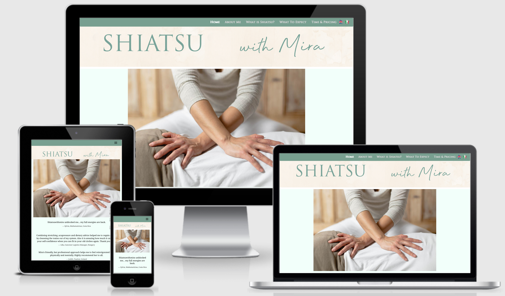

This is a website created for Mira Marioni, a Shiatsu specialist. The client picked out the entire colour scheme as she wished for it to match her already printed out contact cards. The client specifically wanted the fade in callout to be vibrant on mobile/tablet screens. The client wanted a more tone down style to fit with the laidback and relaxed feel of her practice. The client also preferred to have a toned-down 'active' colour depending on the page you are on. The client and I worked closely on this project with help from a senior developer Matt Rudge for the callout on the index page. The client handpicked the fonts and colours and the photos were supplied by a friend of the clients. The website is fully functional in English and the clients native Italian. All of the text content was supplied from the client as well. The website was built using Bootstrap for the layout and JavaScript/jQuery to help out with some of the functionality, specifically switching from English to Italian. There is functionality that will be able to assume whether the website should first appear in Italian or English.